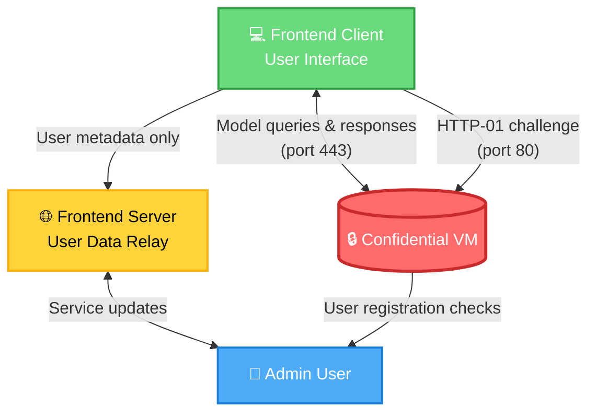

# Architecture Overview

Umbra is architected as a multi-layer system that ensures sensitive data is processed securely within trusted execution environments (TEEs). This page explains the system architecture, component interactions, and security guarantees.

## System Components

Umbra consists of three main components working together:

<CardGroup cols={3}>
  <Card title="Frontend" icon="browser">
    Next.js 16 application with React 19, TypeScript, Tailwind CSS, and shadcn/ui components. Handles user interaction, RA-TLS connection management, and client-side attestation verification.
  </Card>
  
  <Card title="CVM Services" icon="server">
    Python/FastAPI microservices running in Confidential VMs on Phala Cloud. Includes attestation service, auth service, and certificate management with Nginx.
  </Card>
  
  <Card title="Monitoring Stack" icon="chart-line">
    Prometheus and Grafana for collecting and visualizing vLLM metrics, system health, and performance data.
  </Card>
</CardGroup>

## Repository Structure

```
umbra/
├── frontend/          # Next.js 16 app (React 19, TypeScript, Tailwind, shadcn/ui)
├── cvm/               # Confidential VM services (Python/FastAPI)
│   ├── attestation-service/   # TDX attestation (FastAPI + dstack_sdk)
│   ├── auth-service/          # Token-based auth (HTTP server)
│   ├── cert-manager/          # Nginx + Let's Encrypt + EKM
│   └── docker-compose.yml     # Service orchestration
├── monitoring/        # Prometheus + Grafana for vLLM metrics
├── docs/              # Architecture diagrams
└── scripts/           # TDX utility scripts
```

## Data Flow

The following diagram illustrates how data flows through the Umbra platform from submission to processing:

<Steps>
  <Step title="User submits prompt and documents via frontend">
    The user enters a prompt and optionally uploads sensitive documents (text or PDFs) through the web interface at `/confidential-ai`. Files up to 100 MB are supported, with PDFs converted to text using pdf.js.
  </Step>
  
  <Step title="Frontend connects through proxy using RA-TLS">
    The browser establishes a WebSocket connection to the RA-TLS proxy (`NEXT_PUBLIC_RATLS_PROXY_URL`), which bridges WebSocket to TCP and forwards raw bytes to the TEE. The connection uses the Atlas library from [concrete-security/atlas](https://github.com/concrete-security/atlas).
  </Step>
  
  <Step title="Request routed through nginx with TLS termination">
    All traffic passes through Nginx, which handles:
    - TLS termination with Let's Encrypt certificates
    - EKM (Exported Key Material) channel binding per RFC 9266
    - Request routing to appropriate backend services
    - CORS and security header enforcement
  </Step>
  
  <Step title="Attestation service generates TDX quotes">
    The FastAPI attestation service uses `dstack_sdk` to generate Intel TDX quotes that cryptographically prove the execution environment's integrity. The quote includes:
    - Measurement of the running code and configuration
    - TCB (Trusted Computing Base) status
    - TEE type and security properties
  </Step>
  
  <Step title="Frontend verifies TDX attestation locally">
    The browser performs DCAP (Data Center Attestation Primitives) quote verification entirely client-side using the `@phala/dcap-qvl-web` WebAssembly library. This verification:
    - Validates the quote signature using Intel's signing keys
    - Checks the TCB status and security version numbers
    - Ensures the TEE measurements match expected values
    - **Requires no server trust** - all verification happens in your browser
  </Step>
  
  <Step title="vLLM processes request inside TEE">
    Once attestation is verified, the prompt and documents are sent to vLLM running inside the Intel TDX Confidential VM. All processing happens in encrypted memory that is inaccessible to the host operating system or cloud provider.
  </Step>
  
  <Step title="Response streams back with metrics collection">
    The AI model's response streams back over the secure channel using Server-Sent Events (SSE). Prometheus scrapes performance metrics from vLLM's `/metrics` endpoint, which is protected by authentication.
  </Step>
</Steps>

<Info>
  The attestation verification step is crucial—it ensures that data is only sent to a genuine TEE running the expected code. The verification happens **entirely in your browser**, so you don't need to trust any server.
</Info>

## Component Diagram

The following diagram shows the relationships between system components:



### Component Responsibilities

**Frontend Client (`FC`)**
- Renders the user interface using Next.js and React
- Manages RA-TLS connection establishment and maintenance
- Performs client-side attestation verification using WebAssembly
- Handles file uploads and PDF text extraction
- Streams AI responses and displays reasoning panels
- Stores provider settings in browser localStorage/sessionStorage

**Confidential VM (`CVM`)**
- Runs Intel TDX-enabled virtual machine on Phala Cloud
- Hosts attestation service (FastAPI + dstack_sdk)
- Hosts authentication service for token validation
- Runs vLLM for AI model inference in encrypted memory
- Manages TLS certificates via cert-manager and Let's Encrypt
- Enforces EKM channel binding for TLS security

**Frontend Server (`FS`)**
- Hosts Next.js server-side rendering and API routes
- Manages Supabase authentication and session handling
- Stores waitlist requests and user metadata in Supabase
- Proxies chat completions without accessing tokens (stored client-side)
- Sends waitlist activation emails via Resend
- Enforces RLS (Row-Level Security) policies

**Admin User (`BMU`)**
- Manages waitlist requests through `/admin/waitlist`
- Activates new users and sends magic link invitations
- Monitors service health and system metrics
- Configures user roles and permissions

## Security Mechanisms

Umbra implements multiple layers of security to protect sensitive data:

### Intel TDX Attestation

<Card title="Client-Side Verification" icon="shield-check">
  Attestation quotes are verified entirely in the browser using DCAP QVL. The frontend validates:
  
  - **Quote signature** - Cryptographic proof from Intel
  - **TCB status** - Trusted Computing Base security level
  - **Measurements** - Hash of code and configuration
  - **Security version numbers** - Ensures up-to-date firmware
  
  No server trust is required—you verify the TEE yourself.
</Card>

### EKM Channel Binding

<Card title="RFC 9266 Compliance" icon="link">
  Exported Key Material (EKM) channel binding ties application-layer authentication to the TLS connection:
  
  - Nginx extracts EKM from TLS 1.3 session (`tls-exporter` per RFC 5705)
  - HMAC-SHA256 binds EKM to request using `EKM_SHARED_SECRET`
  - Attestation service validates HMAC to prevent MITM attacks
  - Ensures end-to-end security from client to TEE
</Card>

### Supabase Row-Level Security

<Card title="Database Access Control" icon="database">
  All database queries enforce Row-Level Security policies:
  
  - Users can only access their own waitlist requests
  - Admin endpoints require `admin` role in `app_metadata`
  - Service-role key is kept server-side only
  - Magic link generation includes signed metadata
</Card>

### HMAC-Signed Form Tokens

<Card title="Anti-Bot Protection" icon="lock">
  Waitlist and feedback forms use signed tokens to prevent abuse:
  
  - Tokens generated by `/api/form-token` with 10-minute expiry
  - HMAC signature using `FORM_TOKEN_SECRET`
  - Honeypot fields to catch bots
  - Rate limiting by IP address
  - Same-origin enforcement for CSRF protection
</Card>

## Frontend Architecture

### Application Structure

The Next.js frontend uses the App Router with the following key pages:

| Route | Description |
|-------|-------------|
| `/` | Landing page with hero prompt, trust badges, and waitlist CTA |
| `/team` | Team members and advisory board |
| `/confidential-ai` | Streaming chat workspace with RA-TLS and attestation UI |
| `/sign-in` | Supabase authentication with email/password |
| `/admin/waitlist` | Admin console for managing waitlist requests |
| `/api/chat/completions` | OpenAI-compatible proxy for vLLM |
| `/api/waitlist` | Waitlist submission with HMAC token validation |
| `/api/feedback` | Feedback submission endpoint |

### Key Libraries and Technologies

- **@concrete-security/atlas-wasm** - RA-TLS client with attestation verification
- **@supabase/ssr** - Server-side Supabase authentication
- **@radix-ui/react-*** - Accessible UI primitives (shadcn/ui)
- **pdfjs-dist** - Client-side PDF text extraction
- **react-markdown + remark-gfm** - Markdown rendering with GitHub flavor
- **rehype-sanitize** - XSS protection for rendered content

### RA-TLS Client Architecture

The RA-TLS implementation (`lib/ratls-client.ts`) provides:

```typescript
// Create RA-TLS fetch client with attestation callback
const ratlsFetch = await createRatlsClient(
  {
    proxyUrl: 'wss://proxy.example.com',
    targetHost: 'tee-server.example.com',
    targetPort: 443
  },
  (attestation) => {
    console.log('Attestation result:', attestation.trusted)
    console.log('TEE type:', attestation.teeType)
    console.log('TCB status:', attestation.tcbStatus)
  }
)

// Use like regular fetch
const response = await ratlsFetch('/v1/chat/completions', {
  method: 'POST',
  body: JSON.stringify({ messages })
})
```

## CVM Services Architecture

### Service Orchestration

All CVM services are orchestrated using Docker Compose:

```yaml
services:
  nginx:          # TLS termination, EKM, routing
  attestation:    # TDX quote generation (FastAPI)
  auth:           # Token validation
  vllm:           # AI model inference (production)
  mock-vllm:      # Mock service (development)
```

### Attestation Service

The attestation service (`cvm/attestation-service/`) provides:

- **GET /health** - Service health check
- **GET /attestation/quote** - Generate TDX attestation quote
- **POST /attestation/verify** - Verify attestation evidence
- **GET /attestation/policy** - Retrieve attestation policy

Implementation uses:
- FastAPI for HTTP endpoints
- `dstack_sdk` for TDX quote generation
- HMAC validation of EKM headers
- Development mode bypass with `NO_TDX=true`

### Certificate Management

The cert-manager service handles:
- Let's Encrypt certificate provisioning via ACME protocol
- Automatic certificate renewal
- EKM extraction from TLS 1.3 sessions
- HMAC signing of EKM using `EKM_SHARED_SECRET`
- Nginx configuration with security headers

## Monitoring Architecture

The monitoring stack (`monitoring/`) includes:

### Prometheus
- Scrapes vLLM `/metrics` endpoint with authentication
- Collects system metrics (CPU, memory, network)
- Stores time-series data with configurable retention
- Provides alerting rules for service health

### Grafana
- Visualizes Prometheus metrics with pre-built dashboards
- Displays vLLM performance (tokens/sec, latency, queue depth)
- System resource utilization graphs
- Custom alerting and notification channels

<Tip>
  To start the monitoring stack: `cd monitoring && make docker-up`
</Tip>

## Deployment Architecture

Umbra uses a multi-environment deployment strategy:

### Frontend Deployment
- **Platform:** Vercel
- **Trigger:** Auto-deploys from `main` branch
- **Build:** Next.js production build (`pnpm build`)
- **CI:** GitHub Actions for tests and linting

### CVM Deployment
- **Platform:** Phala Cloud (Intel TDX-enabled infrastructure)
- **Registry:** GitHub Container Registry (GHCR)
- **Build:** Docker images pushed via GitHub Actions
- **Orchestration:** Docker Compose on Phala Cloud

### Environment Variables

See the [Quickstart Guide](/quickstart) for detailed environment configuration.

## Security Considerations

<Warning>
  **Critical Security Points:**
  
  - Never commit secrets to version control (use `.env.example` templates)
  - `FORM_TOKEN_SECRET` and `EKM_SHARED_SECRET` must be strong random values
  - `SUPABASE_SERVICE_ROLE_KEY` must remain server-side only
  - Provider tokens are stored client-side in sessionStorage (never on server)
  - Attestation verification must happen before sending sensitive data
  - Production deployments must use real TDX hardware (not `NO_TDX=true`)
</Warning>

## Performance Characteristics

### Frontend
- Next.js 16 with React 19 Server Components
- Optimized bundle size with code splitting
- Streaming responses for immediate feedback
- Progressive PDF loading for large documents
- Client-side caching of provider settings

### CVM Services
- FastAPI with async/await for high concurrency
- Nginx connection pooling and keepalive
- vLLM tensor parallelism for model inference
- Prometheus metrics collection (minimal overhead)

### Network
- WebSocket multiplexing for RA-TLS proxy
- Server-Sent Events (SSE) for streaming responses
- HTTP/2 where supported by infrastructure
- TLS 1.3 with 0-RTT resumption

## Testing Strategy

Umbra uses a comprehensive testing approach:

### Frontend Tests
- **Vitest** - Unit tests for utilities and components
- **Playwright** - E2E tests for user flows
- **Test mode** - `NEXT_PUBLIC_ATTESTATION_TEST_MODE=true` skips real attestation

### CVM Tests
- **pytest** - Unit tests for Python services
- **Integration suite** - `test_cvm.py` validates all endpoints
- **Production mode** - `DEV=false` tests production configurations

### CI/CD
- GitHub Actions runs all tests on every PR
- Linting and type checking enforced
- Docker image builds validated
- Deployment gated on test success

## Next Steps

<CardGroup cols={2}>
  <Card title="Security Deep Dive" icon="shield" href="/security">
    Learn about Intel TDX, attestation, and threat model
  </Card>
  
  <Card title="API Reference" icon="code" href="/api-reference">
    Explore the CVM service APIs and integration options
  </Card>
</CardGroup>