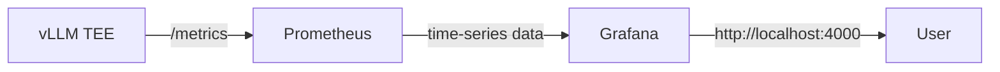

## Architecture

Umbra's monitoring stack provides real-time visibility into vLLM model performance using a containerized Prometheus and Grafana deployment.

### Components

<CardGroup cols={2}>
  <Card title="Prometheus" icon="chart-line">
    Scrapes vLLM `/metrics` endpoint and stores time-series data
  </Card>
  <Card title="Grafana" icon="chart-area">
    Visualizes metrics through pre-configured dashboards
  </Card>
  <Card title="vLLM" icon="microchip">
    Exposes detailed runtime metrics at `/metrics` endpoint
  </Card>
  <Card title="Docker Network" icon="network-wired">
    Internal network for service communication
  </Card>
</CardGroup>

### Data Flow

1. **vLLM** exposes a `/metrics` endpoint with detailed runtime metrics about the model
2. **Prometheus** continuously scrapes this endpoint and stores the data as structured time series
3. **Grafana** displays these metrics using pre-configured dashboards

## Available Dashboards

The monitoring stack includes three pre-configured dashboards:

### User Metrics Overview

Tracks user-facing performance metrics:

- **TTFT** (Time to First Token)
- **End-to-end latency**
- **Queue waiting time**
- **Number of running requests**

### Machine Metrics Overview

Monitors hardware resource utilization:

- **GPU usage and memory**
- **CPU workload**
- **Running and waiting requests**
- **System resource consumption**

### vLLM Tokens Dashboard

Provides token-level metrics for throughput analysis.

## Configuration Strategy

The monitoring stack uses a secure two-step configuration process:

<Steps>
  <Step title="Environment Variables">
    Sensitive credentials and endpoints are stored in `.env` file (never committed to Git)
  </Step>
  
  <Step title="Template Processing">
    Configuration files are generated from `.template` files with whitelisted variable substitution
  </Step>
  
  <Step title="Lifecycle Management">
    Generated configs are created on build and automatically deleted on stop
  </Step>
</Steps>

<Info>
  **Why Templates?**
  
  This approach protects internal Grafana and Prometheus variables (like `$job` or `$datasource`) from being accidentally replaced while allowing safe injection of secrets.
</Info>

### Whitelisted Variables

**Prometheus** (`prometheus.yml.template`):
- `${SCHEME}` - HTTP or HTTPS protocol
- `${VLLM_TARGET}` - vLLM endpoint address
- `${VLLM_METRICS_AUTH_TOKEN}` - Bearer token for metrics access

**Grafana** (dashboard JSON templates):
- `${VLLM_SCRAPE_JOB_NAME}` - Prometheus job name
- `${GRAFANA_DATASOURCE_UID}` - Data source identifier

## Access

Once running, the monitoring interfaces are available at:

- **Grafana**: `http://localhost:4000` (or custom `GRAFANA_PORT`)
- **Prometheus**: Internal Docker network only (not exposed publicly)

<Warning>
  Prometheus is intentionally not exposed publicly. All queries should be performed through Grafana dashboards.
</Warning>
